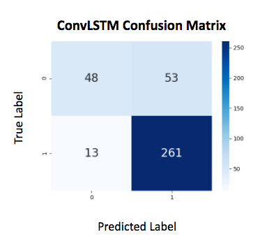

# SkinCredible
[Insight AI Fellowship Consulting Project] In collaboration with [CureSkin](https://cureskin.com/), SkinCredible leverages 
 deep learning to help dermatologists monitor facial skin conditions over time. Given a series of images taken at different 
 points in time by a user, the idea is to classify whether the user's facial skin condition has improved or deteriorated over time.
 
 
 ## How It Works
SkinCredible uses a combination of Convolutional Neural Networks (CNNs) and Long Short-Term Memory networks (LSTMs) trained
 on a proprietary dataset provided by [CureSkin](https://cureskin.com/) to learn the representation of the spatiotemporal sequence of image dataset.
Images can be taken from different angles and orientations, so I apply a pre-processing step and use the pre-trained Multi-Task Cascaded Convolutional Neural Network (MTCNN) to extract
faces from the image sequence. Since ground truth labels are not available for this supervised learning problem, I came up with the idea to apply sentiment
 analysis with AWS Comprehend to dermatologists' notes to create proxy labels for training.
 
## Files 
`model`: Directory containing the ConvLSTM model
> `data_augment.py`: Create new images flipped horizontally to reduce the problem of unbalanced dataset

> `evaluate.py`: Output evaluataion metrics for validation/test dataset

> `face_detection.py`: Extract faces from images with MTCNNs

> `get_data.py`: Pre-process raw dataset stored in AWS S3 private bucket

> `network_architection`: Define the ConvLSTM model

> `opts.py`: Contain project arguments and hyperparameters

> `predict.py`: Output ConvLSTM predictions

> `split.py`: Split dataset into train, validation and test set

> `train.py`: Run distributed training of the model with multi-GPUs

> `utils.py`: Contain helper functions

`api`: Directory for the RESTful Web API with Flask

`tests`: Simple unit tests for the API

`data`: Directory containing anonymized dataset

## Results
The model achieves 82% accuracy and 83% precision. Keep in mind that the dataset is imbalanced,
with 70% postive samples and 30% negative samples. The figure below shows a confusion matrix summarizing the outputs of the trained model.

 
 
  
 
 